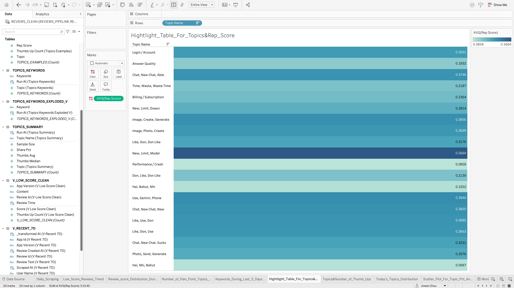

# ChatGPT_Reviews_Pain_Point_Monitoring_Layer(Snowflake&Tableau)


This project builds a **monitoring dashboard** that connects **Snowflake** to **Tableau**, enabling daily insights into app review pain points (scraping pipeline → Snowflake → Tableau Extract → Tableau Cloud).

---

## 1. Connection Setup

Connected Tableau Desktop to **Snowflake** using the following parameters:

- **Warehouse**: `COMPUTE_WH`  
- **Database**: `REVIEWS_PIPELINE`  
- **Schema**: `ANALYTICS`  

Verified access to core tables:
- `REVIEWS_CLEAN`: All cleaned reviews are stored here. 
- `TOPICS_EXAMPLES`: One of the resulting tables from product-team centric analysis, contains review-related information, topic names and 5 example reviews for each topic. This table accumulated every single day through the daily automatic pipeline. The column **'RUN_AT'** indicates when the content is generated. 
- `TOPICS_KEYWORDS`: One of the resulting tables from product-team centric analysis, contains topic index and related keywords. Likewise, this table accumulated every single day through the daily automatic pipeline. The column **'RUN_AT'** indicates when the content is generated.
- `TOPICS_SUMMARY`: One of the resulting tables from product-team centric analysis, contains topic index, topic names, share percent of a certain topic in a given day, sample size, median and average thumb-up calculation for a certain topic.  Likewise, this table accumulated every single day through the daily automatic pipeline. The column **'RUN_AT'** indicates when the content is generated.

Verified access to views:
- `V_LOW_SCORE_CLEAN`: Contains the reviews has a score less than equal to 2. 
- `V_RECENT_7D`: Contains all reviews generated in the most recent 7 days. 
- `TOPICS_KEYWORDS_EXPLODED_V`: This view is created to help with data visualization in Tableau. Each row contains a singular topic keyword and **'RUN_AT'** which indicates when the content is generated.

---

## 2. Data Modeling

- In Tableau **Logical Layer**, dragged in multiple Snowflake tables to create a unified data source.
- Base tables: `REVIEWS_CLEAN`, `TOPICS_EXAMPLES`, `TOPICS_KEYWORDS`, `TOPICS_SUMMARY`
- Views: `V_LOW_SCORE_CLEAN`, `V_RECENT_7D`, `TOPICS_KEYWORDS_EXPLODED_V`
- 

---

## 3. Workbook Interpretation
- There is a total of 9 worksheets in the final workbook. The monitoring dashboard is composed of 7 of them. It doesn't mean that the rest two sheets are less important. The main reason is that putting 9 worksheets in dashboard would make everything hard to read.
- Worksheet 1: Rooted from the table:`REVIEWS_CLEAN`. It reflects the daily scraping amount. The default is 2000. If the number of new reviews is greater than 2000, the pipeline would scrape 2000 most recent reviews. If the number of new reviews is less than 2000, the pipeline would scrape that number of reviews. Because I was doing testing before August 15th, so I set a filter to make sure the data visualization starts from August 15th.
- 

- Worksheet 2: Rooted from the view:`V_LOW_SCORE_CLEAN`. It reflects the trend on number of low score(1-2) reviews that is being created everyday. If some day this trend goes wild, the product team may need to pay extra attention. 
- 

- Worksheet 3: Rooted from the view:`V_RECENT_7D`. It reflects the distribution of reviews based on their scores during the recent 7-days period. 
- 

- Worksheet 4: Rooted from the table:`TOPICS_SUMMARY`. It reflects the trend on number of pain-point topics that are generated everyday. 
- 

- Worksheet 5: Rooted from the view:`TOPICS_KEYWORDS_EXPLODED_V`. It reflects 30 most popular topic keywords(pain point) during the last 3 days. 
- 

- Worksheet 6: Rooted from the table:`TOPICS_EXAMPLES`. It reflects different topics and their corresponding average rep score. The average rep score indicates how related are the reviews and the problems, which are topic names in this case. 
- 

- Worksheet 7: Rooted from the table:`TOPICS_EXAMPLES`. It reflects distribution of different topic names and total thumb-up counts. I sort them in descending order.
- 

- Worksheet 8: Rooted from the table:`TOPICS_SUMMARY`. It reflects distribution of different topic names in today's scraping.
- 

- Worksheet 9: Rooted from the table:`TOPICS_SUMMARY`. It is a scatter plot regarding average thumb-up count and daily shared percentage of topics. I disaggregate the data so everything is showing in the greatest levle of detail. The dates are implied by color and the topic names are implied by different shapes. 
- 

- Dashboard: Monitoring Layer
- 

---

## 4. Extract Configuration

After I finished building the dashboard, I switched from **Live Connection** to **Extract** to reduce Snowflake credit usage.

Extract settings:
- **Data Storage**: Logical Tables  
- **Filters**: None  
- **Aggregation**: None  
- **Number of Rows**: All rows  
- **Incremental Refresh**: Disabled (using **full refresh** for consistency)

This ensures dashboards load from an Extract (Hyper file) instead of continuously querying Snowflake.

---

## 5. Publishing to Tableau Cloud

Published the workbook to **Tableau Cloud**:

- **Project**: Default  
- **Workbook Name**: `Chatgpt_Reviews_Pain_Point_Analysis`  
- **Data Source**: Embedded in workbook  

---

## 6. Refreshing Extract(whenever we need to see the live update, we can mannually refresh on Tableau Online/Cloud)

- Extract does **not auto-update** unless refreshed.  
- Supervisor can manually trigger refresh from Tableau Cloud:  
  `... → Refresh Data Extract`  
- Filters like **“Today”** or **“Last 7 Days”** calculate based on Extract content.  
  → Extract refresh is required for updated results.

---

## 7. Credit Consumption(only consume credits when mannually refresh extract)

- **Browsing dashboards** → No Snowflake credits consumed.  
- **Refreshing Extract** (manual or scheduled) → Snowflake credits consumed.  (we could to this, but in order to save credit, I choose **mannual**)
- Current setup: **manual full refresh** for stability.  

---

## 8. Key Notes
 
- Local `.twb` files are optional backups. (I saved on my desktop) 
- The **authoritative version** is maintained in **Tableau Cloud**.

---

## 9. Personal Reflection

---

## Project Flow

```mermaid
flowchart LR
  A[App Reviews Scraping] --> B[Snowflake Pipeline]
  B --> C[Tableau Extract]
  C --> D[Tableau Cloud Dashboard]
