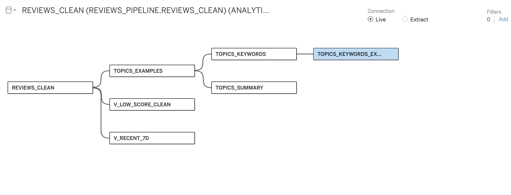

# ChatGPT_Reviews_Pain_Point_Monitoring_Layer(Snowflake&Tableau)


This project builds a **monitoring dashboard** that connects **Snowflake** to **Tableau**, enabling daily insights into app review pain points (scraping pipeline → Snowflake → Tableau Extract → Tableau Cloud).

---

## 1. Connection Setup

Connected Tableau Desktop to **Snowflake** using the following parameters:

- **Warehouse**: `COMPUTE_WH`  
- **Database**: `REVIEWS_PIPELINE`  
- **Schema**: `ANALYTICS`  

Verified access to core tables:
- `REVIEWS_CLEAN`: All cleaned reviews are stored here. 
- `TOPICS_EXAMPLES`: One of the resulting tables from product-team centric analysis, contains review-related information, topic names and 5 example reviews for each topic. This table accumulated every single day through the daily automatic pipeline. The column **'RUN_AT'** indicates when the content is generated. 
- `TOPICS_KEYWORDS`: One of the resulting tables from product-team centric analysis, contains topic index and related keywords. Likewise, this table accumulated every single day through the daily automatic pipeline. The column **'RUN_AT'** indicates when the content is generated.
- `TOPICS_SUMMARY`: One of the resulting tables from product-team centric analysis, contains topic index, topic names, share percent of a certain topic in a given day, sample size, median and average thumb-up calculation for a certain topic.  Likewise, this table accumulated every single day through the daily automatic pipeline. The column **'RUN_AT'** indicates when the content is generated.

Verified access to views:
- `V_LOW_SCORE_CLEAN`: Contains the reviews has a score less than equal to 2. 
- `V_RECENT_7D`: Contains all reviews generated in the most recent 7 days. 
- `TOPICS_KEYWORDS_EXPLODED_V`: This view is created to help with data visualization in Tableau. Each row contains a singular topic keyword and **'RUN_AT'** which indicates when the content is generated.

---

## 2. Data Modeling

- In Tableau **Logical Layer**, dragged in multiple Snowflake tables to create a unified data source.
- Base tables: `REVIEWS_CLEAN`, `TOPICS_EXAMPLES`, `TOPICS_KEYWORDS`, `TOPICS_SUMMARY`
- Views: `V_LOW_SCORE_CLEAN`, `V_RECENT_7D`, `TOPICS_KEYWORDS_EXPLODED_V`
- 

---

## 3. Workbook Interpretation
- There is a total of 9 worksheets in the final workbook. The monitoring dashboard is composed of 7 of them. It doesn't mean that the rest two sheets are less important. The main reason is that putting 9 worksheets in dashboard would make everything hard to read.
- Worksheet 1: 

---

## 4. Extract Configuration

After I finished building the dashboard, I switched from **Live Connection** to **Extract** to reduce Snowflake credit usage.

Extract settings:
- **Data Storage**: Logical Tables  
- **Filters**: None  
- **Aggregation**: None  
- **Number of Rows**: All rows  
- **Incremental Refresh**: Disabled (using **full refresh** for consistency)

This ensures dashboards load from an Extract (Hyper file) instead of continuously querying Snowflake.

---

## 5. Publishing to Tableau Cloud

Published the workbook to **Tableau Cloud**:

- **Project**: Default  
- **Workbook Name**: `Chatgpt_Reviews_Pain_Point_Analysis`  
- **Data Source**: Embedded in workbook  

---

## 6. Refreshing Extract

- Extract does **not auto-update** unless refreshed.  
- Supervisor can manually trigger refresh from Tableau Cloud:  
  `... → Refresh Data Extract`  
- Filters like **“Today”** or **“Last 7 Days”** calculate based on Extract content.  
  → Extract refresh is required for updated results.

---

## 7. Credit Consumption(only consume credits when mannually refresh extract)

- **Browsing dashboards** → No Snowflake credits consumed.  
- **Refreshing Extract** (manual or scheduled) → Snowflake credits consumed.  
- Current setup: **manual full refresh** for stability.  

---

## 8. Key Notes

- Dashboards are **stable, cost-efficient, and supervisor-accessible**.  
- Local `.twb` files are optional backups.  
- The **authoritative version** is maintained in **Tableau Cloud**.

---

## 9. Personal Reflection

---

## Project Flow

```mermaid
flowchart LR
  A[App Reviews Scraping] --> B[Snowflake Pipeline]
  B --> C[Tableau Extract]
  C --> D[Tableau Cloud Dashboard]
